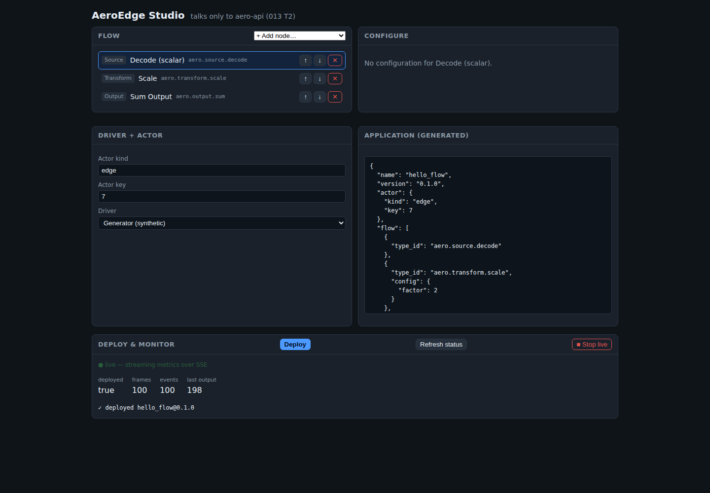

# AeroEdge — Industrial Edge Platform (RFC)

AeroEdge is a **C++ industrial edge platform** for managing edge devices, ingesting
their data, and processing it through a rule/driver/event-driven pipeline. This
repository is the **design RFC first** — a set of specification documents — with an
implementation that follows the design, not the other way around.

## Status

[](https://github.com/thnak/AeroEdge/actions/workflows/ci.yml)

**Draft v0.1 — specified _and_ implemented.** The RFC (specs 001–015) is complete, and Phases 0–10
of the [implementation plan](docs/IMPLEMENTATION-PLAN.md) are built and verified on Linux/x86-64: the
Flow Runtime, Node/Driver SDK, state/persistence, runtime daemon + REST/SSE API + CLI, hot-reload,
native/WASM-seam extensions, transport pluggability, distribution, MES hook, firmware OTA, and the
React Studio.

CI runs the C++ runtime across **GCC 14 + Clang 20 × Release / ASan+UBSan / TSan** and the Studio's
vitest + build on every push — see [Build & run](#build--run). The actor runtime underneath is
**not** ours to build — it is [QuarkCpp](../QuarkCpp) (see below).

## Docs

All documentation lives under [`docs/`](docs/README.md).

- **[Setup Guide](docs/guides/setup-guide.md)** — build from source, run the daemon, run the Studio.
- **[User Guide](docs/guides/user-guide.md)** — deploy & manage flows, the built-in node/driver catalog, the
  rule expression language, the REST API, monitoring.

The rest of this README covers the same build steps for a quick start, plus the architecture.

## Studio

A React + Vite web app ([`studio/`](studio/)) to configure, build, deploy, and monitor flows,
talking only to `aero-api`:



## Build & run

### Prerequisites

- A **C++23** compiler — GCC 13+ or Clang 17+ (verified on GCC 14.2 / Clang 20).
- **CMake ≥ 3.24**.
- **[QuarkCpp](../QuarkCpp)** checked out as a sibling directory (`../QuarkCpp`), or point at it with
  `-DQUARK_DIR=/path/to/QuarkCpp`. AeroEdge links it as `quark::quark` — it is never forked or vendored.
- **Node 18+ / npm** — only for the Studio.

### Build & test the C++ core

```bash
# from the repo root, with QuarkCpp at ../QuarkCpp
cmake -S . -B build -DCMAKE_BUILD_TYPE=Release
cmake --build build -j
ctest --test-dir build --output-on-failure          # 29 deterministic tests
```

Sanitizer builds (the CI matrix — must stay green):

```bash
cmake -S . -B build-asan -DCMAKE_BUILD_TYPE=Debug -DAEROEDGE_SANITIZER=address,undefined
cmake --build build-asan -j && ctest --test-dir build-asan
cmake -S . -B build-tsan -DCMAKE_BUILD_TYPE=Debug -DAEROEDGE_SANITIZER=thread
cmake --build build-tsan -j && ctest --test-dir build-tsan
# swap the compiler with a leading `CXX=clang++` on the configure line
```

### Run the daemon + CLI

```bash
./build/aero-runtime --port 8080 &                  # the edge runtime daemon (aero-api on :8080)

./build/aero deploy examples/hello_flow.json        # deploy a declarative Application
./build/aero status                                 # -> frames_processed:100, last_output:198, ...
./build/aero reload examples/hello_flow.json        # hot-reload (0 dropped Commands)
./build/aero rollback hello_flow                    # roll back to the previous version
./build/aero undeploy hello_flow
```

The management API is REST + JSON (`POST /apps`, `GET /status`, `PUT /apps/{name}`,
`POST /apps/{name}/rollback`, `DELETE /apps/{name}`) with live metrics over SSE (`GET /metrics/stream`).

### Run the Studio (web UI)

```bash
cd studio
npm install
npm run dev                                          # http://localhost:5173, proxies /api -> :8080
npm test -- --run                                    # 14 vitest tests
npm run build                                        # tsc typecheck + vite build
```

Point the Studio at a daemon elsewhere with `VITE_API_URL=http://<host>:<port> npm run dev`. To verify
the whole loop (daemon + Studio + proxy) in one shot: `bash studio/scripts/e2e.sh` → prints `E2E OK`.

### Project layout

| Target | What | Plane |
|---|---|---|
| `aero-sdk` | `INode`/`IDriver`/`ProcessingContext` — the stable extension contract | runtime |
| `aero-core` | Flow Runtime + compiler, `EdgeActorBase`, registries | runtime |
| `aero-nodes` · `aero-drivers` | built-in nodes & drivers | runtime |
| `aero-mes` · `aero-ota` · `aero-cluster` · `aero-transport` | MES hook, firmware OTA, placement, transports | runtime |
| `aero-runtime` (daemon) · `aero-api` · `aero` (CLI) | the deployable edge daemon + REST/SSE + CLI | runtime |
| `studio/` | React + Vite web app (talks only to `aero-api`) | tooling |

See [013-Solution-Topology-and-Studio.md](docs/specs/013-Solution-Topology-and-Studio.md) for the full module map.

## The single most important design decision

**AeroEdge does not implement an actor runtime. It builds on [QuarkCpp](../QuarkCpp).**

Quark already provides — and has *proven* under its ADRs — everything in the "Actor
Runtime" band of the original architecture sketch: mailboxes, scheduling, activation
lifecycle, timers, isolation, persistence, streaming ingestion, and clustering. AeroEdge
would only weaken those guarantees by re-implementing them. Instead, AeroEdge is a
**domain layer on top of Quark**:

```text
                        AeroEdge (this repo)
    ┌───────────────────────────────────────────────────────────┐
    │  Domain Actors   EdgeActor · LineActor · RobotActor        │  ← quark::Actor subclasses
    │  Flow Runtime    Command → Context → compiled DAG → Event  │  ← NEW: the core we build
    │  Node SDK        INode: Source · Transform · Rule · Output │  ← NEW: extension contract
    │  Drivers         PLC · MQTT · TCP · Serial · Camera        │  ← NEW: source adapters
    └───────────────────────────────────────────────────────────┘
                              │ builds on
    ┌───────────────────────────────────────────────────────────┐
    │  QuarkCpp — actor engine (mailbox, scheduler, lifecycle,   │
    │  timers, persistence, streaming, clustering)  [reused]     │
    └───────────────────────────────────────────────────────────┘
```

What AeroEdge actually builds is the **middle and bottom** of the original diagram:
the Flow Execution Engine, the Node/DAG model, and the Drivers. See
[001-Actor-Model-and-Quark-Mapping.md](docs/specs/001-Actor-Model-and-Quark-Mapping.md) for the
exact primitive-by-primitive mapping.

## Reading order

The RFC lives in [`docs/specs/`](docs/specs/) — see the **[documentation index](docs/README.md)** for
the full reading order (overview → implementation plan → specs 001–021).

## Design principles (one-liners; full text in the overview)

- **Actor owns the runtime** — not Flow, not Node. Lifecycle & scheduling belong to Quark.
- **Flow owns orchestration** — the DAG decides what runs next.
- **Node owns logic** — a Node knows only its `ProcessingContext`, never the Actor or Flow.
- **Command mutates, Event notifies.** Commands are FIFO-sequential; Events are immutable.
- **Compile once.** A Flow is compiled to a DAG at deploy time, never rebuilt per execution.
- **Extensions never control lifecycle.** No Node sleeps, blocks long, or spawns threads.
- **Don't rebuild Quark.** Every actor-runtime concern is delegated, not reimplemented.
