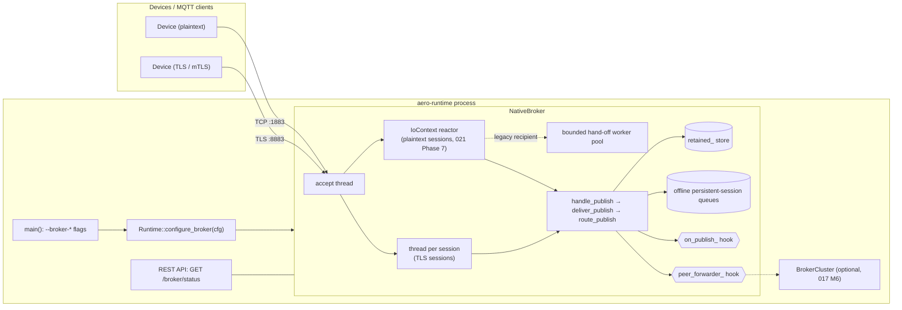
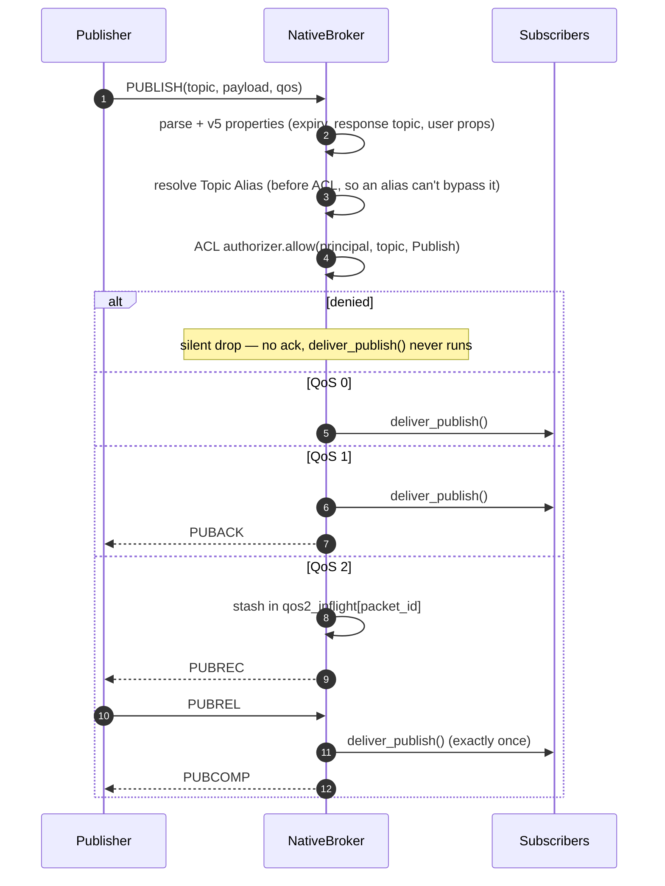
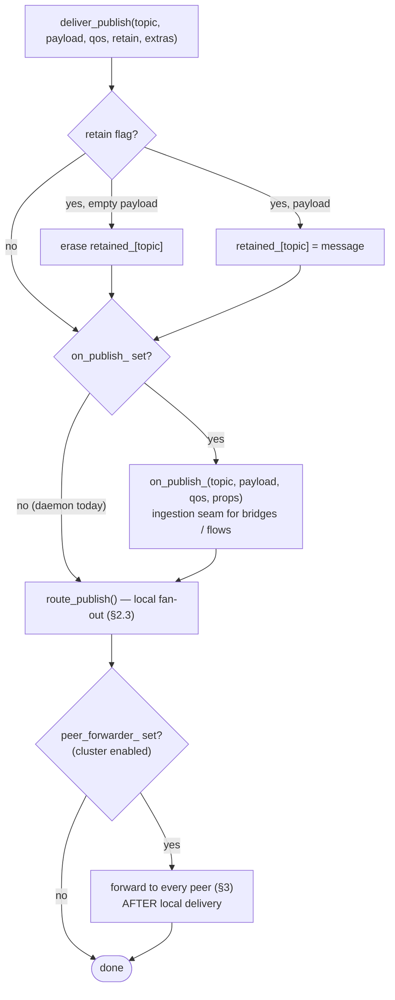
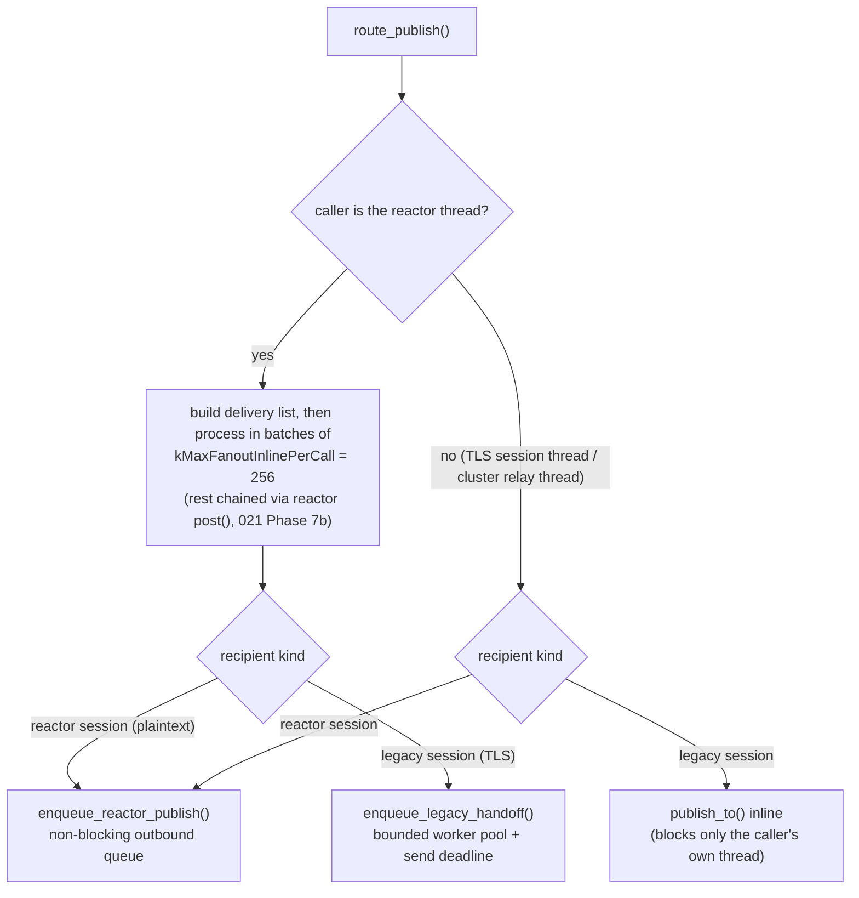
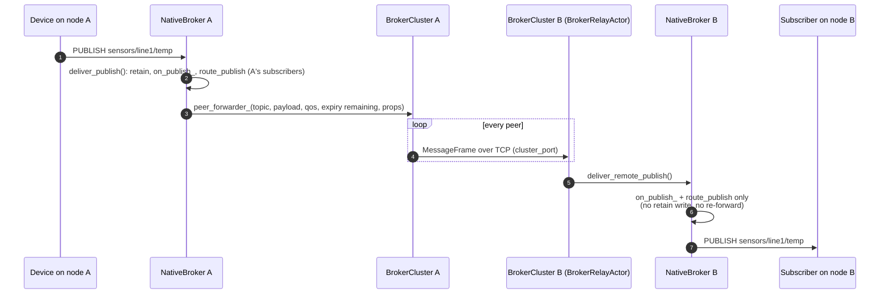
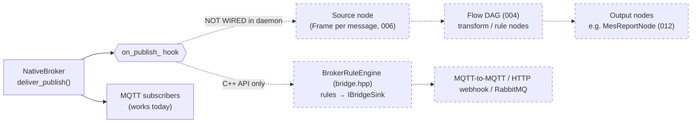

# Native MQTT Broker — Where It Runs and What Happens to a Message

> Explainer for the embedded broker of spec [017](specs/017-Native-Broker-and-Southbound-Termination.md)
> (with the I/O redesign of [021](specs/021-Native-Broker-Performance-Redesign.md)). Describes the code
> **as it is today** — gaps are called out explicitly. Source of truth:
> `include/aero/broker/native_broker.hpp`, `include/aero/broker/broker_cluster.hpp`,
> `include/aero/runtime/runtime.hpp` (`configure_broker()`), `src/runtime/aero_runtime_main.cpp`.

## 1. Where the broker lives

The broker is **not** a separate server — it is `NativeBroker`, a subsystem inside the `aero-runtime`
daemon. It is off by default and started only when a `--broker-*` flag is passed:

```text
aero-runtime --broker-port 1883 [--broker-bind 0.0.0.0]
             [--broker-tls-cert X --broker-tls-key Y [--broker-tls-ca Z]] [--broker-tls-port 8883]
```

It is **daemon-scoped**: it lives for the daemon's lifetime, independent of which `Application`/flows are
deployed or hot-reloaded. `GET /broker/status` reports whether it is configured.



## 2. What happens when a PUBLISH arrives

### 2.1 Wire-level handshake by QoS

`handle_publish()` parses the packet, resolves MQTT 5 properties / Topic Alias, runs the ACL gate, then
acts according to QoS. Key rule: for QoS 0/1 the message is **delivered before it is acknowledged**, so a
publisher holding a PUBACK can assume subscribers will see it. A denied PUBLISH is **silently dropped** —
no PUBACK/PUBREC is sent; that withheld ack *is* the signal.



A client's **Last Will** takes the same `deliver_publish()` path (with no wire packet or ack) when its
session is torn down abnormally.

### 2.2 `deliver_publish()` — the single shared action

Every locally-originated PUBLISH (QoS 0/1 immediately, QoS 2 at PUBREL, Will at teardown) goes through
one function, so retention, ingestion and routing can never drift apart:



### 2.3 `route_publish()` — local fan-out

1. **Candidate narrowing**: `topic_index_candidates(topic)` returns only sessions that *could* match,
   instead of scanning every session.
2. **Exact match**: each candidate's subscriptions are checked with `topic_matches(filter, topic)`
   (`+` / `#` wildcards). Delivered QoS = `min(publish qos, granted qos)`.
3. **Shared subscriptions** (`$share/group/filter`, MQTT 5): matches are bucketed per (group, filter) and
   exactly **one** member per bucket is chosen, round-robin.
4. **Offline persistent sessions** (`clean_session=0`) with a matching subscription get the message
   queued — **QoS ≥ 1 only** — and flushed on reconnect. Message Expiry is re-checked at send time.
5. **Dispatch** depends on who is calling and who is receiving — the reactor thread must never block:



## 3. Distribution (multi-node) — `BrokerCluster`

Opt-in via `configure_broker(cfg, BrokerClusterConfig{self, cluster_port, peers})`. With an empty peer
list nothing is constructed and the broker is purely single-node.

| Aspect | Behavior today |
|---|---|
| Membership | **Static** peer roster from config — no gossip, failure detection, or dynamic join/leave |
| Link | One multiplexed `TcpTransport` connection per peer on a separate `cluster_port`; optional mTLS (017 M5.1) |
| Fan-out model | **Broadcast**: every locally-received PUBLISH goes to every peer; each peer does its own local wildcard match |
| Loop prevention | Relayed messages enter via `deliver_remote_publish()` — local delivery only, never re-forwarded |
| Retained messages | **Not** synchronized across nodes |
| Session continuity | **Not** carried across nodes |
| Message Expiry | Forwarded as a *relative* remaining duration, re-anchored on the receiving node's clock |
| Daemon wiring | **Gap**: `aero-runtime` has no cluster CLI flags — only reachable via the C++ API / tests |



## 4. Where the message goes *after* the broker — current gap

Spec 017 (N4) intends broker traffic to reach flows through the same Driver/Source contract as every
other ingestion path (006). **That link is not wired in the daemon today**: `Runtime::configure_broker()`
never calls `broker.on_publish(...)` — only tests do. So in a running `aero-runtime`, the broker relays
between MQTT clients and nothing else. The bridge / rule engine (`bridge.hpp`, incl. the RabbitMQ sink)
plugs into the same hook but is also C++-API-only.



To close it: register `on_publish` in `configure_broker()` and add a broker-backed Source node that turns
each `(topic, payload, qos, props)` into a `Frame` for a deployed flow — keeping the callback
non-blocking, since it runs on the reactor / session thread (I1, 004 §4).
