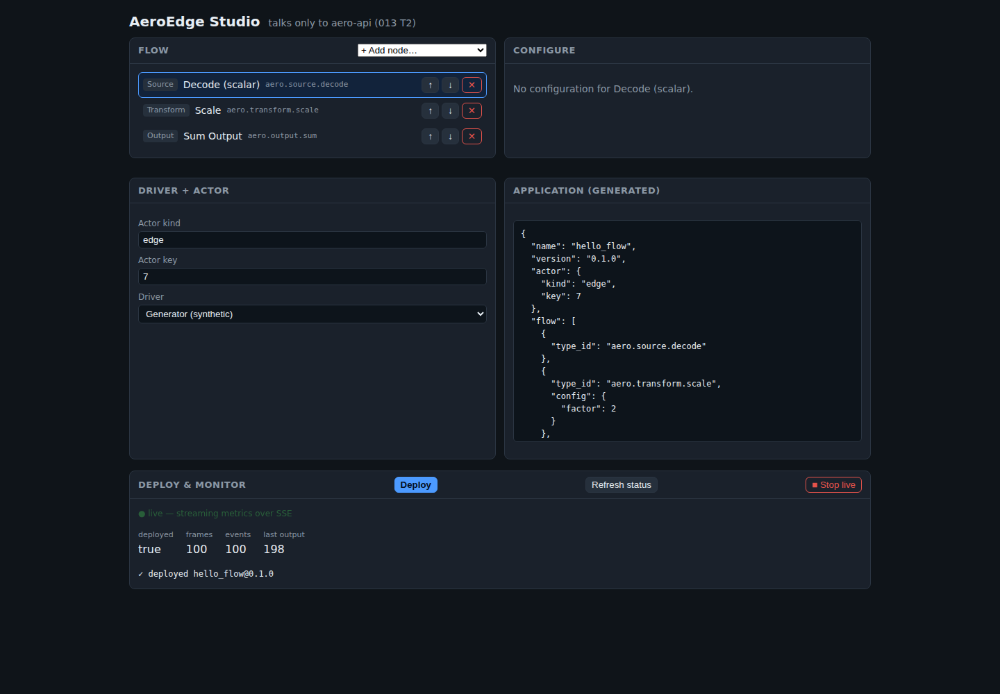

# AeroEdge — User Guide

This guide is for **operators and integrators**: deploying, configuring, and monitoring AeroEdge
flows via the CLI, REST API, or Studio — no C++ required. If you haven't built AeroEdge yet, start
with the **[Setup Guide](setup-guide.md)**.

- [Core concepts](#core-concepts)
- [Your first flow](#your-first-flow)
- [Writing an Application](#writing-an-application)
- [Built-in nodes](#built-in-nodes)
- [Built-in drivers](#built-in-drivers)
- [The rule expression language](#the-rule-expression-language)
- [MES integration nodes](#mes-integration-nodes)
- [Deploying & managing flows (CLI)](#deploying--managing-flows-cli)
- [Deploying & managing flows (REST API)](#deploying--managing-flows-rest-api)
- [Hot-reload vs. redeploy](#hot-reload-vs-redeploy)
- [Monitoring](#monitoring)
- [Using the Studio](#using-the-studio)
- [What's not covered here](#whats-not-covered-here)
- [Troubleshooting](#troubleshooting)

## Core concepts

| Term | Meaning |
|---|---|
| **Application** | The unit of deployment: a name + version, a linear **flow** of nodes, an optional **driver**, an optional **persistence** setting. Written as one JSON document. |
| **Flow** | An ordered pipeline of **nodes** data passes through, one frame at a time: `Source → Transform(s)/Rule(s) → Output`. |
| **Node** | One pipeline step, named by a stable `type_id` (e.g. `aero.transform.scale`), configured with a small JSON object. |
| **Driver** | Where frames come from. Optional — a flow with no driver just sits deployed and idle. |
| **Deploy** | Send an Application to the runtime daemon. It's **compiled once** at deploy time (type_ids resolved, config validated, the pipeline order-checked) — never re-interpreted per frame. A bad Application is rejected with a clear error; nothing half-deploys. |
| **Runtime daemon** (`aero-runtime`) | The process that hosts one deployed Application and exposes it over REST + SSE. One binary per edge node. |

A running daemon hosts **one Application at a time**. Deploying a second one while the first is
still running is rejected — undeploy first, or use **reload** to swap the running Application for a
new version in place (see [Hot-reload vs. redeploy](#hot-reload-vs-redeploy)).

## Your first flow

The repo ships a minimal example at [`examples/hello_flow.json`](../examples/hello_flow.json):

```json
{
  "name": "hello_flow",
  "version": "0.1.0",
  "actor": { "kind": "edge", "key": 7 },
  "flow": [
    { "type_id": "aero.source.decode" },
    { "type_id": "aero.transform.scale", "config": { "factor": 2 } },
    { "type_id": "aero.output.sum" }
  ],
  "driver": { "type_id": "aero.driver.generator", "config": { "frame_count": 100 } }
}
```

It decodes each incoming frame into a value, doubles it, and sums the running total. The driver is
`aero.driver.generator`, a synthetic source that emits 100 frames (values `0..99`) — useful for
trying the platform with no external device attached.

With the daemon running (see [Setup Guide](setup-guide.md#5-run-the-daemon)):

```bash
./build/aero deploy examples/hello_flow.json
# HTTP 200
# {"deployed":true,"name":"hello_flow","version":"0.1.0", ... "frames_processed":100, ...}

./build/aero status
# HTTP 200
# {"deployed":true, "frames_processed":100, "events_published":100, "last_output":198, "output_sum":9900, ...}
```

`last_output` is 198 because the last frame (99) is scaled by 2. That's the whole loop: write an
Application, deploy it, watch it run.

## Writing an Application

Full field reference for the Application JSON document:

| Field | Type | Required | Meaning |
|---|---|---|---|
| `name` | string | **yes** | Unique identifier for this Application. Used in API paths (`/apps/{name}`) and the CLI's `reload`/`rollback`. |
| `version` | string | **yes** | Free-form version string (e.g. semver). Compared to detect a reload vs. a no-op. |
| `actor.kind` | string | no (default `"edge"`) | The actor kind this flow binds to. |
| `actor.key` | integer | no (default `0`) | The actor instance key. Pick any stable integer per logical device/line. |
| `flow` | array of node specs | **yes**, non-empty | The ordered pipeline. Must contain at least one **Source** node and one **Output** node (see [Built-in nodes](#built-in-nodes) for categories). |
| `flow[].type_id` | string | **yes** | Which node (see the catalog below). |
| `flow[].config` | object | no (default `{}`) | Node-specific configuration — see each node's table row. |
| `driver` | object | no | Where frames come from. Omit for a flow with no live input (e.g. deployed but idle). |
| `driver.type_id` | string | required if `driver` present | Which driver (see [Built-in drivers](#built-in-drivers)). |
| `driver.config` | object | no (default `{}`) | Driver-specific configuration. |
| `persistence.model` | string | no | `"snapshot"` or `"event_sourced"` — declares durable-state intent for the actor. |
| `persistence.mode` | string | no | `"sync"` or `"async"`. |

Malformed JSON, a missing required field, an unknown `type_id`, or a flow with no Source/Output node
are all rejected as a clean `400` with a specific message — never a crash or a silent partial deploy.

## Built-in nodes

Every node belongs to exactly one **category**: **Source** (introduces data), **Transform**
(reshapes it), **Rule** (routes / raises events), or **Output** (stages egress). A valid flow needs
at least one Source and one Output.

### Source

| `type_id` | Config | What it does |
|---|---|---|
| `aero.source.decode` | — | Lifts the driver's raw frame value into a tag named `raw`. Pairs with `aero.driver.generator` — this is what [Your first flow](#your-first-flow) uses. |
| `aero.source.json` | — | Parses a JSON object payload (`{"name": number, ...}`) into tags. Malformed JSON → a clean `Error`, never a crash. |
| `aero.source.modbus` | — | Decodes a big-endian 16-bit Modbus holding-register payload into tags `reg0`, `reg1`, … An odd-length (torn) payload → `Error`. |
| `aero.source.mes_order` | `order_qty` (number, default `0`) | Injects the currently-bound MES order quantity as a tag each frame. |

> **Note:** `aero.source.json` and `aero.source.modbus` read the driver's raw **payload bytes**.
> The only built-in driver today, `aero.driver.generator`, produces a bare integer sequence (consumed
> by `aero.source.decode`), not a byte payload — so these two are ready for a payload-producing
> driver (custom or future built-in) but have no built-in driver to pair with yet.

### Transform

| `type_id` | Config | What it does |
|---|---|---|
| `aero.transform.scale` | `factor` (number, **required**) | Multiplies every tag's value by `factor`. |
| `aero.transform.moving_average` | `window` (integer ≥ 1, **required**) | A sliding-window average over the last `window` samples (stateful — resets on restart, see [007](../007-State-and-Persistence.md)). |
| `aero.transform.mean` | — | The arithmetic mean across the *current* frame's tags (not windowed). |
| `aero.transform.minmax` | — | Stages `[min, max]` across the current frame's tags. |
| `aero.transform.sum` | — | Stages the running sum of the current frame's tags (a totalizer). |
| `aero.transform.crc` | — | Stages a CRC-16/CCITT-FALSE checksum of the raw payload bytes — pair with a payload-producing driver, same caveat as `aero.source.json` above. |

### Rule

| `type_id` | Config | What it does |
|---|---|---|
| `aero.rule.expr` | `expr` (string, **required**), `alarm` (string, default `"AlarmRaised"`) | Evaluates a small expression against the working-set tags each frame. If it's non-zero (true), stages an event named `alarm` and **stops the flow early** (later nodes don't run this frame). See [The rule expression language](#the-rule-expression-language). |

### Output

| `type_id` | Config | What it does |
|---|---|---|
| `aero.output.sum` | — | Stages the sum of all tags as the frame's output value. |
| `aero.output.mes` | `line` (string, default `"line-1"`), `label` (string, default `"produced"`), `kind` (`"production"` \| `"alarm"` \| `"tag_sample"`, default `"production"`) | Stages a report for the MES gateway's outbox. See [MES integration nodes](#mes-integration-nodes). |

A malformed node config is rejected at **deploy time** with a node-specific message, e.g.:

```text
node 'aero.transform.scale' requires a numeric 'factor'
node 'aero.transform.moving_average' 'window' must be >= 1
node 'aero.rule.expr' invalid expression: <parser detail>
unknown node type_id: 'aero.transform.frobnicate'
```

## Built-in drivers

| `type_id` | Config | What it does |
|---|---|---|
| `aero.driver.generator` | `frame_count` (integer, default `0` = unbounded) | Emits a synthetic monotone sequence of frames (`0, 1, 2, …`) as fast as backpressure allows. `frame_count: 0` runs until the flow is undeployed. Pairs with `aero.source.decode`. |

`aero.driver.generator` is the only built-in driver today — it's a deterministic stand-in used to
exercise a flow with no external device. Real protocol drivers (TCP/Modbus-TCP/MQTT device ingestion)
are on the roadmap; see [006-Drivers-and-Sources.md](../006-Drivers-and-Sources.md) for the design.

## The rule expression language

`aero.rule.expr` evaluates a small, deliberately non-Turing-complete expression (no loops, no
function calls, no state — it cannot hang) against the current frame's tags:

```text
expr    := or
or      := and    ( '||' and )*
and     := equ    ( '&&' equ )*
equ     := cmp    ( ('=='|'!=') cmp )*
cmp     := add    ( ('<'|'>'|'<='|'>=') add )*
add     := mul    ( ('+'|'-') mul )*
mul     := unary  ( ('*'|'/') unary )*
unary   := ('!'|'-') unary | primary
primary := number | tagref | '(' expr ')'
tagref  := 'tag("name")' | bare_identifier
```

Values are doubles; `true`/`false` are `1.0`/`0.0`. A missing tag reads as `0.0`. Example — raise an
alarm when a `temp` tag exceeds 90:

```json
{ "type_id": "aero.rule.expr", "config": { "expr": "tag(\"temp\") > 90", "alarm": "HighTempAlarm" } }
```

When the expression is true, the flow stops for that frame and stages a `HighTempAlarm` event instead
of continuing to later nodes — useful for gating an Output node behind a threshold, or short-
circuiting expensive downstream processing on bad data.

## MES integration nodes

Two flow nodes bridge a flow to the MES integration hook ([spec 012](../012-MES-Integration-Hook.md))
without touching gateway internals:

- **`aero.output.mes`** stages a report (production count, alarm, or tag sample — set via `kind`)
  from the current frame's tags. The report is only *staged* here; the runtime's MES gateway durably
  queues it in a transactional outbox and delivers it **at-least-once**, surviving MES downtime.
- **`aero.source.mes_order`** surfaces the currently-bound MES order (e.g. a target quantity) as a
  tag each frame, so downstream nodes can react to it (progress-vs-target, a rule expression, etc).

The outbox/gateway/exactly-once-delivery mechanics are a runtime-level concern, not something you
configure per-flow — see [012-MES-Integration-Hook.md](../012-MES-Integration-Hook.md) if you're
standing up the MES adapter side.

## Deploying & managing flows (CLI)

`build/aero` is a thin client for the daemon's REST API. Every command accepts `--url
http://host:port` (default `http://127.0.0.1:8080`) and exits `0` on success, non-zero otherwise.

```bash
aero deploy   <app.json>          # deploy a new Application (fails if one is already running)
aero status                       # current status snapshot
aero reload   <app.json>          # hot-reload the RUNNING Application to a new version
aero rollback <name>              # roll back to the previous version (after at least one reload)
aero undeploy <name>              # stop and remove the running Application
```

Each command prints the HTTP status and JSON body it got back, so it doubles as a debugging tool —
run any command and read the response directly.

## Deploying & managing flows (REST API)

The CLI is a shell over these endpoints; call them directly from any HTTP client (`curl`, a
CI pipeline, your own tooling):

| Method | Path | Body | Response |
|---|---|---|---|
| `GET` | `/health` | — | `ok` — readiness probe |
| `POST` | `/apps` | Application JSON | `200` + status snapshot, or `400` + `{"error": "..."}` |
| `GET` | `/status` | — | `200` + status snapshot |
| `GET` | `/apps` | — | `200` + list of deployed Applications |
| `PUT` | `/apps/{name}` | new Application JSON | `200` + status, or `400` if it's a BuildOnly change (see below) |
| `POST` | `/apps/{name}/rollback` | — | `200` + status, or `400` if there's no previous version |
| `DELETE` | `/apps/{name}` | — | `200` + `{"undeployed": "{name}"}`, or `404` |
| `GET` | `/metrics/stream` | — | `text/event-stream` (SSE) — live status snapshots every ~100ms |

```bash
curl -sS -X POST http://127.0.0.1:8080/apps \
  -H 'Content-Type: application/json' \
  --data @examples/hello_flow.json

curl -sS http://127.0.0.1:8080/status | jq

curl -sS -X DELETE http://127.0.0.1:8080/apps/hello_flow
```

## Hot-reload vs. redeploy

`PUT /apps/{name}` (`aero reload`) swaps the running Application for a new version **without**
tearing down the actor — but only for changes the runtime classifies as **Live**:

- **Live** (hot-swappable in place): the flow graph itself (add/remove/reorder nodes) and any node
  `config`. Applied atomically — every frame before the swap runs the old flow, every frame after runs
  the new one; nothing is dropped or double-processed.
- **BuildOnly** (needs a fresh deploy): changing `actor.kind`/`actor.key`, or `persistence.model`/
  `persistence.mode`. Rejected with a `400` and a message like:
  ```text
  BuildOnly change requires redeploy (undeploy first): <reason>
  ```
  no partial state is ever applied.

`aero rollback <name>` reverts to the immediately-previous version (one level of undo — requires at
least one prior successful reload). Rollback follows the same Live/BuildOnly rules as reload.

## Monitoring

`GET /status` (and each SSE event on `/metrics/stream`) returns:

| Field | Meaning |
|---|---|
| `deployed` | `false` if nothing is running (all other fields absent). |
| `name`, `version` | The running Application's identity. |
| `actor_key`, `actor_kind` | The bound actor. |
| `has_driver` | Whether a driver is attached. |
| `frames_processed` | Total frames run through the flow so far. |
| `events_published` | Total events staged (e.g. by `aero.rule.expr`). |
| `last_output` | The most recent Output node's value. |
| `output_sum` | Running total across all Output-staged values. |
| `reloads` | How many hot-reloads this Application has been through. |

For a live dashboard, subscribe to the SSE stream instead of polling `/status`:

```bash
curl -N http://127.0.0.1:8080/metrics/stream
# data: {"deployed":true,"frames_processed":42,...}
# data: {"deployed":true,"frames_processed":57,...}
# ...
```

## Using the Studio

If you'd rather not hand-write JSON and `curl`, the [Studio](../studio/README.md) is a web UI over
the same REST API:

- **Flow Designer** — assemble a flow from the node catalog visually; it emits the same canonical
  Application JSON described above.
- **Config forms** — auto-generated per-node config forms (the [Built-in nodes](#built-in-nodes)
  table above, rendered as UI).
- **Deploy & Monitor** — deploy, watch live metrics over SSE, reload, rollback — all from the browser.



*The `hello_flow` pipeline from [Your first flow](#your-first-flow) (Decode → Scale → Sum) in the
Flow Designer, its generated Application JSON alongside, and Deploy & Monitor streaming metrics
live over SSE — the same `frames`/`events`/`last output` fields from [Monitoring](#monitoring).*

Start it per the [Setup Guide](setup-guide.md#6-optional-run-the-studio-web-ui) and point it at your
running daemon.

## What's not covered here

This guide covers what's operator-configurable **through an Application JSON / the CLI / the REST
API** today. A few platform capabilities exist at a lower level and aren't yet exposed through that
surface — if you need them, they're worth reading about but are currently a build/deploy-time or
cluster-operator concern rather than something you set in flow JSON:

- **Transport adapters** (TCP/MQTT/gRPC for cross-node actor messaging) — [014](../014-Transport-Interface-and-Pluggable-Transports.md).
- **Multi-node distribution & placement** — [010](../010-Distribution-and-Horizontal-Scale.md).
- **Firmware OTA rollout** — [011-Firmware-OTA.md](../011-Firmware-OTA.md).
- **Writing custom nodes/drivers** (native `.so` or WASM extensions) — [008](../008-Extension-Model-Native-and-WASM.md).

## Troubleshooting

**`HTTP 400 {"error":"a runtime hosts one Application; undeploy '<name>' first"}`**
You tried `deploy` while an Application is already running. Either `undeploy` it first, or use
`reload` if you meant to update it in place.

**`HTTP 400 {"error":"unknown node type_id: '...'"}`**
Check the spelling against the [Built-in nodes](#built-in-nodes) catalog — `type_id` is exact-match.

**`HTTP 400 {"error":"flow has no Source node: ..."}` / `"...no Output node: ..."`**
Every flow needs at least one node from each category. See [Built-in nodes](#built-in-nodes) for
which `type_id`s are Source vs. Output.

**`HTTP 400 {"error":"BuildOnly change requires redeploy ..."}`**
You tried to `reload`/`rollback` across a change that can't be hot-swapped (actor identity or
persistence settings). Undeploy, then deploy the new version fresh — see
[Hot-reload vs. redeploy](#hot-reload-vs-redeploy).

**`HTTP 404 {"error":"no such app: '<name>'"}`**
The `{name}` in your `PUT`/`DELETE` path doesn't match the currently-deployed Application's `name`
field (from its JSON), not an arbitrary label.

**Nothing happens after deploy (`frames_processed` stays 0)**
Your Application has no `driver`, so nothing is producing frames — this is valid (a flow can be
deployed and idle), but check that a `driver` block is present if you expected it to run.
